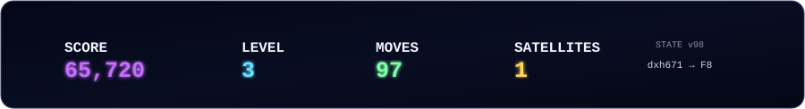
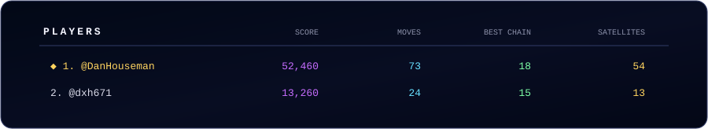

  

  Click any playable gem to submit the move.

 

<picture><source media="(max-width: 420px)" srcset="assets/gems/sm/empty.svg"><source media="(max-width: 760px)" srcset="assets/gems/md/empty.svg"></picture><picture><source media="(max-width: 420px)" srcset="assets/gems/sm/empty.svg"><source media="(max-width: 760px)" srcset="assets/gems/md/empty.svg"></picture><picture><source media="(max-width: 420px)" srcset="assets/gems/sm/empty.svg"><source media="(max-width: 760px)" srcset="assets/gems/md/empty.svg"></picture><picture><source media="(max-width: 420px)" srcset="assets/gems/sm/empty.svg"><source media="(max-width: 760px)" srcset="assets/gems/md/empty.svg"></picture><picture><source media="(max-width: 420px)" srcset="assets/gems/sm/empty.svg"><source media="(max-width: 760px)" srcset="assets/gems/md/empty.svg"></picture><picture><source media="(max-width: 420px)" srcset="assets/gems/sm/empty.svg"><source media="(max-width: 760px)" srcset="assets/gems/md/empty.svg"></picture><picture><source media="(max-width: 420px)" srcset="assets/gems/sm/empty.svg"><source media="(max-width: 760px)" srcset="assets/gems/md/empty.svg"></picture><picture><source media="(max-width: 420px)" srcset="assets/gems/sm/empty.svg"><source media="(max-width: 760px)" srcset="assets/gems/md/empty.svg"></picture>

<picture><source media="(max-width: 420px)" srcset="assets/gems/sm/empty.svg"><source media="(max-width: 760px)" srcset="assets/gems/md/empty.svg"></picture><picture><source media="(max-width: 420px)" srcset="assets/gems/sm/empty.svg"><source media="(max-width: 760px)" srcset="assets/gems/md/empty.svg"></picture><picture><source media="(max-width: 420px)" srcset="assets/gems/sm/empty.svg"><source media="(max-width: 760px)" srcset="assets/gems/md/empty.svg"></picture><picture><source media="(max-width: 420px)" srcset="assets/gems/sm/empty.svg"><source media="(max-width: 760px)" srcset="assets/gems/md/empty.svg"></picture><picture><source media="(max-width: 420px)" srcset="assets/gems/sm/empty.svg"><source media="(max-width: 760px)" srcset="assets/gems/md/empty.svg"></picture><picture><source media="(max-width: 420px)" srcset="assets/gems/sm/empty.svg"><source media="(max-width: 760px)" srcset="assets/gems/md/empty.svg"></picture><picture><source media="(max-width: 420px)" srcset="assets/gems/sm/empty.svg"><source media="(max-width: 760px)" srcset="assets/gems/md/empty.svg"></picture><picture><source media="(max-width: 420px)" srcset="assets/gems/sm/empty.svg"><source media="(max-width: 760px)" srcset="assets/gems/md/empty.svg"></picture>

<picture><source media="(max-width: 420px)" srcset="assets/gems/sm/empty.svg"><source media="(max-width: 760px)" srcset="assets/gems/md/empty.svg"></picture><picture><source media="(max-width: 420px)" srcset="assets/gems/sm/empty.svg"><source media="(max-width: 760px)" srcset="assets/gems/md/empty.svg"></picture><picture><source media="(max-width: 420px)" srcset="assets/gems/sm/empty.svg"><source media="(max-width: 760px)" srcset="assets/gems/md/empty.svg"></picture><picture><source media="(max-width: 420px)" srcset="assets/gems/sm/empty.svg"><source media="(max-width: 760px)" srcset="assets/gems/md/empty.svg"></picture><picture><source media="(max-width: 420px)" srcset="assets/gems/sm/empty.svg"><source media="(max-width: 760px)" srcset="assets/gems/md/empty.svg"></picture><picture><source media="(max-width: 420px)" srcset="assets/gems/sm/empty.svg"><source media="(max-width: 760px)" srcset="assets/gems/md/empty.svg"></picture><picture><source media="(max-width: 420px)" srcset="assets/gems/sm/empty.svg"><source media="(max-width: 760px)" srcset="assets/gems/md/empty.svg"></picture><picture><source media="(max-width: 420px)" srcset="assets/gems/sm/empty.svg"><source media="(max-width: 760px)" srcset="assets/gems/md/empty.svg"></picture>

<picture><source media="(max-width: 420px)" srcset="assets/gems/sm/empty.svg"><source media="(max-width: 760px)" srcset="assets/gems/md/empty.svg"></picture><picture><source media="(max-width: 420px)" srcset="assets/gems/sm/empty.svg"><source media="(max-width: 760px)" srcset="assets/gems/md/empty.svg"></picture><picture><source media="(max-width: 420px)" srcset="assets/gems/sm/empty.svg"><source media="(max-width: 760px)" srcset="assets/gems/md/empty.svg"></picture><a href="https://github.com/DanHouseman/DanHouseman/issues/new?title=%5BPLAY%5D%20Platonic%20Neighbors%20D4&body=MOVE%3AD4%0ASTATE%3A98%0A%0ASubmit%20this%20issue%20to%20play."><picture><source media="(max-width: 420px)" srcset="assets/gems/sm/shell-c2-s2-plain.svg"><source media="(max-width: 760px)" srcset="assets/gems/md/shell-c2-s2-plain.svg"></picture></a><picture><source media="(max-width: 420px)" srcset="assets/gems/sm/gem-c0-s0-plain.svg"><source media="(max-width: 760px)" srcset="assets/gems/md/gem-c0-s0-plain.svg"></picture><picture><source media="(max-width: 420px)" srcset="assets/gems/sm/empty.svg"><source media="(max-width: 760px)" srcset="assets/gems/md/empty.svg"></picture><picture><source media="(max-width: 420px)" srcset="assets/gems/sm/empty.svg"><source media="(max-width: 760px)" srcset="assets/gems/md/empty.svg"></picture><picture><source media="(max-width: 420px)" srcset="assets/gems/sm/empty.svg"><source media="(max-width: 760px)" srcset="assets/gems/md/empty.svg"></picture>

<picture><source media="(max-width: 420px)" srcset="assets/gems/sm/empty.svg"><source media="(max-width: 760px)" srcset="assets/gems/md/empty.svg"></picture><picture><source media="(max-width: 420px)" srcset="assets/gems/sm/empty.svg"><source media="(max-width: 760px)" srcset="assets/gems/md/empty.svg"></picture><picture><source media="(max-width: 420px)" srcset="assets/gems/sm/empty.svg"><source media="(max-width: 760px)" srcset="assets/gems/md/empty.svg"></picture><a href="https://github.com/DanHouseman/DanHouseman/issues/new?title=%5BPLAY%5D%20Platonic%20Neighbors%20D5&body=MOVE%3AD5%0ASTATE%3A98%0A%0ASubmit%20this%20issue%20to%20play."><picture><source media="(max-width: 420px)" srcset="assets/gems/sm/gem-c3-s3-satellite.svg"><source media="(max-width: 760px)" srcset="assets/gems/md/gem-c3-s3-satellite.svg"></picture></a><a href="https://github.com/DanHouseman/DanHouseman/issues/new?title=%5BPLAY%5D%20Platonic%20Neighbors%20E5&body=MOVE%3AE5%0ASTATE%3A98%0A%0ASubmit%20this%20issue%20to%20play."><picture><source media="(max-width: 420px)" srcset="assets/gems/sm/gem-c3-s3-plain.svg"><source media="(max-width: 760px)" srcset="assets/gems/md/gem-c3-s3-plain.svg"></picture></a><picture><source media="(max-width: 420px)" srcset="assets/gems/sm/empty.svg"><source media="(max-width: 760px)" srcset="assets/gems/md/empty.svg"></picture><picture><source media="(max-width: 420px)" srcset="assets/gems/sm/empty.svg"><source media="(max-width: 760px)" srcset="assets/gems/md/empty.svg"></picture><picture><source media="(max-width: 420px)" srcset="assets/gems/sm/empty.svg"><source media="(max-width: 760px)" srcset="assets/gems/md/empty.svg"></picture>

<picture><source media="(max-width: 420px)" srcset="assets/gems/sm/empty.svg"><source media="(max-width: 760px)" srcset="assets/gems/md/empty.svg"></picture><picture><source media="(max-width: 420px)" srcset="assets/gems/sm/empty.svg"><source media="(max-width: 760px)" srcset="assets/gems/md/empty.svg"></picture><picture><source media="(max-width: 420px)" srcset="assets/gems/sm/empty.svg"><source media="(max-width: 760px)" srcset="assets/gems/md/empty.svg"></picture><picture><source media="(max-width: 420px)" srcset="assets/gems/sm/empty.svg"><source media="(max-width: 760px)" srcset="assets/gems/md/empty.svg"></picture><picture><source media="(max-width: 420px)" srcset="assets/gems/sm/empty.svg"><source media="(max-width: 760px)" srcset="assets/gems/md/empty.svg"></picture><picture><source media="(max-width: 420px)" srcset="assets/gems/sm/empty.svg"><source media="(max-width: 760px)" srcset="assets/gems/md/empty.svg"></picture><picture><source media="(max-width: 420px)" srcset="assets/gems/sm/empty.svg"><source media="(max-width: 760px)" srcset="assets/gems/md/empty.svg"></picture><picture><source media="(max-width: 420px)" srcset="assets/gems/sm/empty.svg"><source media="(max-width: 760px)" srcset="assets/gems/md/empty.svg"></picture>

<picture><source media="(max-width: 420px)" srcset="assets/gems/sm/empty.svg"><source media="(max-width: 760px)" srcset="assets/gems/md/empty.svg"></picture><picture><source media="(max-width: 420px)" srcset="assets/gems/sm/empty.svg"><source media="(max-width: 760px)" srcset="assets/gems/md/empty.svg"></picture><picture><source media="(max-width: 420px)" srcset="assets/gems/sm/empty.svg"><source media="(max-width: 760px)" srcset="assets/gems/md/empty.svg"></picture><picture><source media="(max-width: 420px)" srcset="assets/gems/sm/empty.svg"><source media="(max-width: 760px)" srcset="assets/gems/md/empty.svg"></picture><picture><source media="(max-width: 420px)" srcset="assets/gems/sm/empty.svg"><source media="(max-width: 760px)" srcset="assets/gems/md/empty.svg"></picture><picture><source media="(max-width: 420px)" srcset="assets/gems/sm/empty.svg"><source media="(max-width: 760px)" srcset="assets/gems/md/empty.svg"></picture><picture><source media="(max-width: 420px)" srcset="assets/gems/sm/empty.svg"><source media="(max-width: 760px)" srcset="assets/gems/md/empty.svg"></picture><picture><source media="(max-width: 420px)" srcset="assets/gems/sm/empty.svg"><source media="(max-width: 760px)" srcset="assets/gems/md/empty.svg"></picture>

<picture><source media="(max-width: 420px)" srcset="assets/gems/sm/empty.svg"><source media="(max-width: 760px)" srcset="assets/gems/md/empty.svg"></picture><picture><source media="(max-width: 420px)" srcset="assets/gems/sm/empty.svg"><source media="(max-width: 760px)" srcset="assets/gems/md/empty.svg"></picture><picture><source media="(max-width: 420px)" srcset="assets/gems/sm/empty.svg"><source media="(max-width: 760px)" srcset="assets/gems/md/empty.svg"></picture><picture><source media="(max-width: 420px)" srcset="assets/gems/sm/empty.svg"><source media="(max-width: 760px)" srcset="assets/gems/md/empty.svg"></picture><picture><source media="(max-width: 420px)" srcset="assets/gems/sm/empty.svg"><source media="(max-width: 760px)" srcset="assets/gems/md/empty.svg"></picture><picture><source media="(max-width: 420px)" srcset="assets/gems/sm/empty.svg"><source media="(max-width: 760px)" srcset="assets/gems/md/empty.svg"></picture><picture><source media="(max-width: 420px)" srcset="assets/gems/sm/empty.svg"><source media="(max-width: 760px)" srcset="assets/gems/md/empty.svg"></picture><picture><source media="(max-width: 420px)" srcset="assets/gems/sm/empty.svg"><source media="(max-width: 760px)" srcset="assets/gems/md/empty.svg"></picture>

 

  

 

  

 

  

