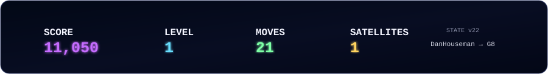
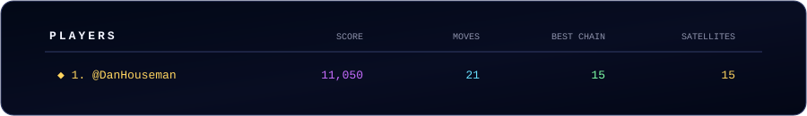
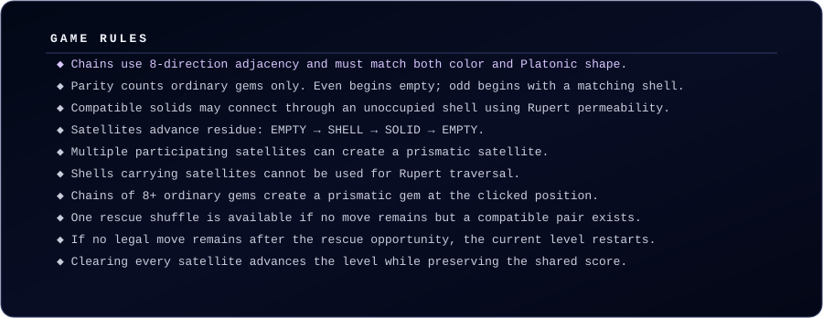
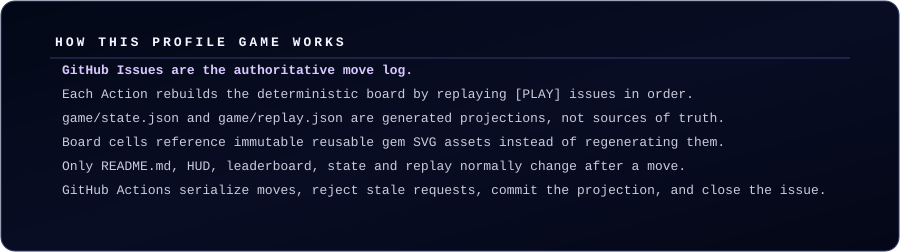

  

  Click any playable gem to submit the move.

 

<picture><source media="(max-width: 420px)" srcset="assets/gems/sm/empty.svg"><source media="(max-width: 760px)" srcset="assets/gems/md/empty.svg"></picture><picture><source media="(max-width: 420px)" srcset="assets/gems/sm/empty.svg"><source media="(max-width: 760px)" srcset="assets/gems/md/empty.svg"></picture><picture><source media="(max-width: 420px)" srcset="assets/gems/sm/empty.svg"><source media="(max-width: 760px)" srcset="assets/gems/md/empty.svg"></picture><picture><source media="(max-width: 420px)" srcset="assets/gems/sm/empty.svg"><source media="(max-width: 760px)" srcset="assets/gems/md/empty.svg"></picture><picture><source media="(max-width: 420px)" srcset="assets/gems/sm/empty.svg"><source media="(max-width: 760px)" srcset="assets/gems/md/empty.svg"></picture><picture><source media="(max-width: 420px)" srcset="assets/gems/sm/empty.svg"><source media="(max-width: 760px)" srcset="assets/gems/md/empty.svg"></picture><picture><source media="(max-width: 420px)" srcset="assets/gems/sm/empty.svg"><source media="(max-width: 760px)" srcset="assets/gems/md/empty.svg"></picture><picture><source media="(max-width: 420px)" srcset="assets/gems/sm/empty.svg"><source media="(max-width: 760px)" srcset="assets/gems/md/empty.svg"></picture>

<picture><source media="(max-width: 420px)" srcset="assets/gems/sm/empty.svg"><source media="(max-width: 760px)" srcset="assets/gems/md/empty.svg"></picture><picture><source media="(max-width: 420px)" srcset="assets/gems/sm/empty.svg"><source media="(max-width: 760px)" srcset="assets/gems/md/empty.svg"></picture><picture><source media="(max-width: 420px)" srcset="assets/gems/sm/empty.svg"><source media="(max-width: 760px)" srcset="assets/gems/md/empty.svg"></picture><picture><source media="(max-width: 420px)" srcset="assets/gems/sm/empty.svg"><source media="(max-width: 760px)" srcset="assets/gems/md/empty.svg"></picture><picture><source media="(max-width: 420px)" srcset="assets/gems/sm/empty.svg"><source media="(max-width: 760px)" srcset="assets/gems/md/empty.svg"></picture><picture><source media="(max-width: 420px)" srcset="assets/gems/sm/empty.svg"><source media="(max-width: 760px)" srcset="assets/gems/md/empty.svg"></picture><picture><source media="(max-width: 420px)" srcset="assets/gems/sm/empty.svg"><source media="(max-width: 760px)" srcset="assets/gems/md/empty.svg"></picture><picture><source media="(max-width: 420px)" srcset="assets/gems/sm/empty.svg"><source media="(max-width: 760px)" srcset="assets/gems/md/empty.svg"></picture>

<picture><source media="(max-width: 420px)" srcset="assets/gems/sm/empty.svg"><source media="(max-width: 760px)" srcset="assets/gems/md/empty.svg"></picture><picture><source media="(max-width: 420px)" srcset="assets/gems/sm/empty.svg"><source media="(max-width: 760px)" srcset="assets/gems/md/empty.svg"></picture><picture><source media="(max-width: 420px)" srcset="assets/gems/sm/empty.svg"><source media="(max-width: 760px)" srcset="assets/gems/md/empty.svg"></picture><picture><source media="(max-width: 420px)" srcset="assets/gems/sm/empty.svg"><source media="(max-width: 760px)" srcset="assets/gems/md/empty.svg"></picture><picture><source media="(max-width: 420px)" srcset="assets/gems/sm/empty.svg"><source media="(max-width: 760px)" srcset="assets/gems/md/empty.svg"></picture><picture><source media="(max-width: 420px)" srcset="assets/gems/sm/empty.svg"><source media="(max-width: 760px)" srcset="assets/gems/md/empty.svg"></picture><picture><source media="(max-width: 420px)" srcset="assets/gems/sm/empty.svg"><source media="(max-width: 760px)" srcset="assets/gems/md/empty.svg"></picture><picture><source media="(max-width: 420px)" srcset="assets/gems/sm/empty.svg"><source media="(max-width: 760px)" srcset="assets/gems/md/empty.svg"></picture>

<picture><source media="(max-width: 420px)" srcset="assets/gems/sm/empty.svg"><source media="(max-width: 760px)" srcset="assets/gems/md/empty.svg"></picture><picture><source media="(max-width: 420px)" srcset="assets/gems/sm/empty.svg"><source media="(max-width: 760px)" srcset="assets/gems/md/empty.svg"></picture><picture><source media="(max-width: 420px)" srcset="assets/gems/sm/empty.svg"><source media="(max-width: 760px)" srcset="assets/gems/md/empty.svg"></picture><picture><source media="(max-width: 420px)" srcset="assets/gems/sm/empty.svg"><source media="(max-width: 760px)" srcset="assets/gems/md/empty.svg"></picture><picture><source media="(max-width: 420px)" srcset="assets/gems/sm/empty.svg"><source media="(max-width: 760px)" srcset="assets/gems/md/empty.svg"></picture><picture><source media="(max-width: 420px)" srcset="assets/gems/sm/empty.svg"><source media="(max-width: 760px)" srcset="assets/gems/md/empty.svg"></picture><picture><source media="(max-width: 420px)" srcset="assets/gems/sm/empty.svg"><source media="(max-width: 760px)" srcset="assets/gems/md/empty.svg"></picture><picture><source media="(max-width: 420px)" srcset="assets/gems/sm/empty.svg"><source media="(max-width: 760px)" srcset="assets/gems/md/empty.svg"></picture>

<picture><source media="(max-width: 420px)" srcset="assets/gems/sm/gem-c1-s1-plain.svg"><source media="(max-width: 760px)" srcset="assets/gems/md/gem-c1-s1-plain.svg"></picture><picture><source media="(max-width: 420px)" srcset="assets/gems/sm/empty.svg"><source media="(max-width: 760px)" srcset="assets/gems/md/empty.svg"></picture><picture><source media="(max-width: 420px)" srcset="assets/gems/sm/empty.svg"><source media="(max-width: 760px)" srcset="assets/gems/md/empty.svg"></picture><picture><source media="(max-width: 420px)" srcset="assets/gems/sm/empty.svg"><source media="(max-width: 760px)" srcset="assets/gems/md/empty.svg"></picture><picture><source media="(max-width: 420px)" srcset="assets/gems/sm/empty.svg"><source media="(max-width: 760px)" srcset="assets/gems/md/empty.svg"></picture><picture><source media="(max-width: 420px)" srcset="assets/gems/sm/empty.svg"><source media="(max-width: 760px)" srcset="assets/gems/md/empty.svg"></picture><a href="https://github.com/DanHouseman/DanHouseman/issues/new?title=%5BPLAY%5D%20Platonic%20Neighbors%20G5&body=MOVE%3AG5%0ASTATE%3A22%0A%0ASubmit%20this%20issue%20to%20play."><picture><source media="(max-width: 420px)" srcset="assets/gems/sm/gem-c1-s1-plain.svg"><source media="(max-width: 760px)" srcset="assets/gems/md/gem-c1-s1-plain.svg"></picture></a><picture><source media="(max-width: 420px)" srcset="assets/gems/sm/gem-c2-s2-plain.svg"><source media="(max-width: 760px)" srcset="assets/gems/md/gem-c2-s2-plain.svg"></picture>

<picture><source media="(max-width: 420px)" srcset="assets/gems/sm/gem-c4-s4-plain.svg"><source media="(max-width: 760px)" srcset="assets/gems/md/gem-c4-s4-plain.svg"></picture><picture><source media="(max-width: 420px)" srcset="assets/gems/sm/empty.svg"><source media="(max-width: 760px)" srcset="assets/gems/md/empty.svg"></picture><a href="https://github.com/DanHouseman/DanHouseman/issues/new?title=%5BPLAY%5D%20Platonic%20Neighbors%20C6&body=MOVE%3AC6%0ASTATE%3A22%0A%0ASubmit%20this%20issue%20to%20play."><picture><source media="(max-width: 420px)" srcset="assets/gems/sm/gem-c2-s2-plain.svg"><source media="(max-width: 760px)" srcset="assets/gems/md/gem-c2-s2-plain.svg"></picture></a><a href="https://github.com/DanHouseman/DanHouseman/issues/new?title=%5BPLAY%5D%20Platonic%20Neighbors%20D6&body=MOVE%3AD6%0ASTATE%3A22%0A%0ASubmit%20this%20issue%20to%20play."><picture><source media="(max-width: 420px)" srcset="assets/gems/sm/gem-c1-s1-plain.svg"><source media="(max-width: 760px)" srcset="assets/gems/md/gem-c1-s1-plain.svg"></picture></a><picture><source media="(max-width: 420px)" srcset="assets/gems/sm/empty.svg"><source media="(max-width: 760px)" srcset="assets/gems/md/empty.svg"></picture><picture><source media="(max-width: 420px)" srcset="assets/gems/sm/empty.svg"><source media="(max-width: 760px)" srcset="assets/gems/md/empty.svg"></picture><a href="https://github.com/DanHouseman/DanHouseman/issues/new?title=%5BPLAY%5D%20Platonic%20Neighbors%20G6&body=MOVE%3AG6%0ASTATE%3A22%0A%0ASubmit%20this%20issue%20to%20play."><picture><source media="(max-width: 420px)" srcset="assets/gems/sm/gem-c1-s1-plain.svg"><source media="(max-width: 760px)" srcset="assets/gems/md/gem-c1-s1-plain.svg"></picture></a><picture><source media="(max-width: 420px)" srcset="assets/gems/sm/gem-c4-s4-plain.svg"><source media="(max-width: 760px)" srcset="assets/gems/md/gem-c4-s4-plain.svg"></picture>

<a href="https://github.com/DanHouseman/DanHouseman/issues/new?title=%5BPLAY%5D%20Platonic%20Neighbors%20A7&body=MOVE%3AA7%0ASTATE%3A22%0A%0ASubmit%20this%20issue%20to%20play."><picture><source media="(max-width: 420px)" srcset="assets/gems/sm/gem-c2-s2-plain.svg"><source media="(max-width: 760px)" srcset="assets/gems/md/gem-c2-s2-plain.svg"></picture></a><a href="https://github.com/DanHouseman/DanHouseman/issues/new?title=%5BPLAY%5D%20Platonic%20Neighbors%20B7&body=MOVE%3AB7%0ASTATE%3A22%0A%0ASubmit%20this%20issue%20to%20play."><picture><source media="(max-width: 420px)" srcset="assets/gems/sm/gem-c2-s2-plain.svg"><source media="(max-width: 760px)" srcset="assets/gems/md/gem-c2-s2-plain.svg"></picture></a><a href="https://github.com/DanHouseman/DanHouseman/issues/new?title=%5BPLAY%5D%20Platonic%20Neighbors%20C7&body=MOVE%3AC7%0ASTATE%3A22%0A%0ASubmit%20this%20issue%20to%20play."><picture><source media="(max-width: 420px)" srcset="assets/gems/sm/gem-c2-s2-plain.svg"><source media="(max-width: 760px)" srcset="assets/gems/md/gem-c2-s2-plain.svg"></picture></a><a href="https://github.com/DanHouseman/DanHouseman/issues/new?title=%5BPLAY%5D%20Platonic%20Neighbors%20D7&body=MOVE%3AD7%0ASTATE%3A22%0A%0ASubmit%20this%20issue%20to%20play."><picture><source media="(max-width: 420px)" srcset="assets/gems/sm/gem-c1-s1-plain.svg"><source media="(max-width: 760px)" srcset="assets/gems/md/gem-c1-s1-plain.svg"></picture></a><picture><source media="(max-width: 420px)" srcset="assets/gems/sm/empty.svg"><source media="(max-width: 760px)" srcset="assets/gems/md/empty.svg"></picture><picture><source media="(max-width: 420px)" srcset="assets/gems/sm/empty.svg"><source media="(max-width: 760px)" srcset="assets/gems/md/empty.svg"></picture><a href="https://github.com/DanHouseman/DanHouseman/issues/new?title=%5BPLAY%5D%20Platonic%20Neighbors%20G7&body=MOVE%3AG7%0ASTATE%3A22%0A%0ASubmit%20this%20issue%20to%20play."><picture><source media="(max-width: 420px)" srcset="assets/gems/sm/gem-c1-s1-plain.svg"><source media="(max-width: 760px)" srcset="assets/gems/md/gem-c1-s1-plain.svg"></picture></a><picture><source media="(max-width: 420px)" srcset="assets/gems/sm/gem-c0-s0-satellite.svg"><source media="(max-width: 760px)" srcset="assets/gems/md/gem-c0-s0-satellite.svg"></picture>

<a href="https://github.com/DanHouseman/DanHouseman/issues/new?title=%5BPLAY%5D%20Platonic%20Neighbors%20A8&body=MOVE%3AA8%0ASTATE%3A22%0A%0ASubmit%20this%20issue%20to%20play."><picture><source media="(max-width: 420px)" srcset="assets/gems/sm/gem-c2-s2-plain.svg"><source media="(max-width: 760px)" srcset="assets/gems/md/gem-c2-s2-plain.svg"></picture></a><picture><source media="(max-width: 420px)" srcset="assets/gems/sm/gem-c1-s1-plain.svg"><source media="(max-width: 760px)" srcset="assets/gems/md/gem-c1-s1-plain.svg"></picture><a href="https://github.com/DanHouseman/DanHouseman/issues/new?title=%5BPLAY%5D%20Platonic%20Neighbors%20C8&body=MOVE%3AC8%0ASTATE%3A22%0A%0ASubmit%20this%20issue%20to%20play."><picture><source media="(max-width: 420px)" srcset="assets/gems/sm/gem-c2-s2-plain.svg"><source media="(max-width: 760px)" srcset="assets/gems/md/gem-c2-s2-plain.svg"></picture></a><a href="https://github.com/DanHouseman/DanHouseman/issues/new?title=%5BPLAY%5D%20Platonic%20Neighbors%20D8&body=MOVE%3AD8%0ASTATE%3A22%0A%0ASubmit%20this%20issue%20to%20play."><picture><source media="(max-width: 420px)" srcset="assets/gems/sm/gem-c1-s1-plain.svg"><source media="(max-width: 760px)" srcset="assets/gems/md/gem-c1-s1-plain.svg"></picture></a><a href="https://github.com/DanHouseman/DanHouseman/issues/new?title=%5BPLAY%5D%20Platonic%20Neighbors%20E8&body=MOVE%3AE8%0ASTATE%3A22%0A%0ASubmit%20this%20issue%20to%20play."><picture><source media="(max-width: 420px)" srcset="assets/gems/sm/gem-c2-s2-plain.svg"><source media="(max-width: 760px)" srcset="assets/gems/md/gem-c2-s2-plain.svg"></picture></a><a href="https://github.com/DanHouseman/DanHouseman/issues/new?title=%5BPLAY%5D%20Platonic%20Neighbors%20F8&body=MOVE%3AF8%0ASTATE%3A22%0A%0ASubmit%20this%20issue%20to%20play."><picture><source media="(max-width: 420px)" srcset="assets/gems/sm/gem-c2-s2-plain.svg"><source media="(max-width: 760px)" srcset="assets/gems/md/gem-c2-s2-plain.svg"></picture></a><a href="https://github.com/DanHouseman/DanHouseman/issues/new?title=%5BPLAY%5D%20Platonic%20Neighbors%20G8&body=MOVE%3AG8%0ASTATE%3A22%0A%0ASubmit%20this%20issue%20to%20play."><picture><source media="(max-width: 420px)" srcset="assets/gems/sm/prismatic-c4-s4-plain.svg"><source media="(max-width: 760px)" srcset="assets/gems/md/prismatic-c4-s4-plain.svg"></picture></a><a href="https://github.com/DanHouseman/DanHouseman/issues/new?title=%5BPLAY%5D%20Platonic%20Neighbors%20H8&body=MOVE%3AH8%0ASTATE%3A22%0A%0ASubmit%20this%20issue%20to%20play."><picture><source media="(max-width: 420px)" srcset="assets/gems/sm/gem-c1-s1-plain.svg"><source media="(max-width: 760px)" srcset="assets/gems/md/gem-c1-s1-plain.svg"></picture></a>

 

  

 

  

 

  

